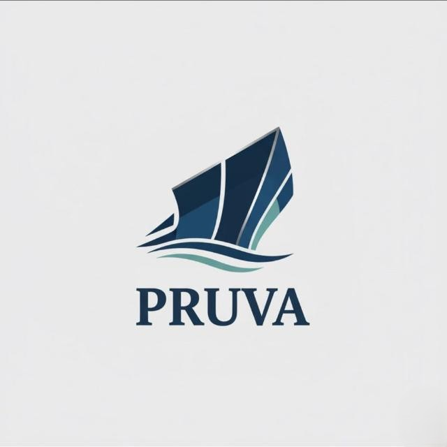

# PRUVA

  

**PRUVA** is a fully autonomous surface vehicle (ASV) project developed by the **KAPSUL YAZGİT** technology community, operating within Konya Technical University.

This repository hosts the official website of the PRUVA team, which is preparing for prestigious autonomous maritime competitions, primarily the **Njord Autonomous Ship Challenge 2026**, **ROBOBOAT 2026**, and **TEKNOFEST**.

On the website, you can explore the technical development processes of the project, our team roster, the latest technical logs, and the media gallery.

🌐 **Explore the Project Website:** 👉 [https://kapsul-yazgit-pruva.github.io/pruva.github.io/](https://kapsul-yazgit-pruva.github.io/pruva.github.io/)

---

## 📄 License

All rights reserved. All content, source code, photographs, and graphic materials belonging to the PRUVA team in this repository are the exclusive property of the team. They may not be copied, reproduced, distributed, or used in any other project for commercial or individual purposes without explicit written permission from the KAPSUL YAZGİT PRUVA team.
